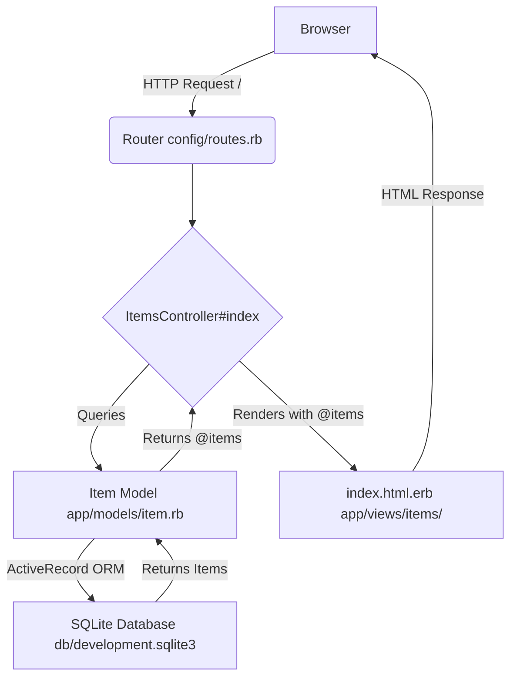

# rails-simple-item-list

A minimal Ruby on Rails application demonstrating fundamental MVC (Model, View, Controller) patterns, core database interactions via ActiveRecord (model definition, migrations, data seeding), and basic routing to display a list of persistent items. It serves as a practical, self-contained learning project for those new to Rails.

## Overview

This project implements a basic Rails application that fetches a list of items from a SQLite database and displays them on a web page. It showcases the foundational concepts of Rails development, including models, views, controllers, migrations, seeding, and routing.

## Architecture Diagram



## Concepts Covered

*   **Rails Application Structure:** Understanding the conventional directory layout.
*   **MVC Pattern:** Separation of concerns with Models, Views, and Controllers.
*   **ActiveRecord ORM:** Defining a model (`Item`) and interacting with the database.
*   **Database Migrations:** Creating and managing database schema changes.
*   **Database Seeding:** Populating the database with sample data (`db/seeds.rb`).
*   **Routing:** Mapping URLs to controller actions (`config/routes.rb`).
*   **ERB Templating:** Embedding Ruby code within HTML for dynamic content (`.html.erb` files).

## How to Run

Follow these steps to set up and run the application locally:

1.  **Ensure Ruby and Rails are Installed:**
    If you don't have Ruby or Rails installed, follow the official Rails guides or use a version manager like `rbenv` or `RVM`.
    ```bash
    ruby -v
    rails -v
    ```
    If not installed, run:
    ```bash
    gem install rails
    ```

2.  **Clone the Repository:**
    ```bash
    git clone https://github.com/aastom/rails-simple-item-list.git
    cd rails-simple-item-list
    ```

3.  **Install Dependencies:**
    ```bash
    bundle install
    ```

4.  **Set Up the Database:**
    *   Run database migrations to create the `items` table:
        ```bash
        rails db:migrate
        ```
    *   Populate the database with sample items using the seed file:
        ```bash
        rails db:seed
        ```

5.  **Start the Rails Server:**
    ```bash
    rails s
    ```

6.  **Access the Application:**
    Open your web browser and navigate to `http://localhost:3000`.

## Expected Output

You should see a simple web page displaying a list of items, each with a name and a description, retrieved from the database. For example:

```
Items List

Item Name: My First Item
Description: This is the description for the first item.

Item Name: Another Item
Description: A second example item for demonstration.
```

## References

*   [Ruby on Rails Guides](https://guides.rubyonrails.org/)
*   [Active Record Basics](https://guides.rubyonrails.org/active_record_basics.html)
*   [Action Controller Overview](https://guides.rubyonrails.org/action_controller_overview.html)
*   [Action View Overview](https://guides.rubyonrails.org/action_view_overview.html)
*   [Rails Routing from the Outside In](https://guides.rubyonrails.org/routing.html)
