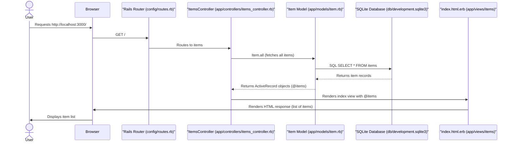

# Architecture Overview: Rails Simple Item List

This document provides a deeper dive into the architectural decisions and flow of the `rails-simple-item-list` application, focusing on how Rails' MVC pattern facilitates the display of data from a database.

## Core Principles

The application adheres strictly to the Model-View-Controller (MVC) architectural pattern, which is fundamental to Ruby on Rails. This separation of concerns ensures maintainability, scalability, and logical organization of the codebase.

*   **Model (ActiveRecord):** Handles data logic, interacting with the database. The `Item` model (`app/models/item.rb`) defines the structure and behavior of our data entities.
*   **View (ERB Templates):** Responsible for presenting data to the user. `app/views/items/index.html.erb` renders the list of items in HTML.
*   **Controller (ActionController):** Acts as an intermediary, processing user requests, interacting with models to fetch/manipulate data, and preparing data for views. `app/controllers/items_controller.rb` manages the flow for displaying items.

## Data Flow (Sequence Diagram)

The following diagram illustrates the sequence of interactions when a user requests the item list page:

## Database Interactions

**Schema Definition:** The `db/migrate/<timestamp>_create_items.rb` file defines the schema for the `items` table, specifying `name` (string) and `description` (text) columns.

**Data Seeding:** `db/seeds.rb` is used to populate the `items` table with initial sample data. This is crucial for local development and demonstration purposes, ensuring there's always data to display.

**ActiveRecord:** The `Item` model inherits from `ApplicationRecord` (which in turn inherits from `ActiveRecord::Base`), providing it with powerful object-relational mapping capabilities. Methods like `Item.all` abstract away raw SQL, allowing developers to interact with the database using Ruby objects.

## Routing

The `config/routes.rb` file defines how incoming HTTP requests are dispatched to controller actions. In this application:

*   `get 'items', to: 'items#index'` maps `GET /items` to the `index` action of the `ItemsController`.
*   `root 'items#index'` makes `GET /` (the application's root URL) also map to `items#index`, providing direct access to the item list upon opening the application.

## Front-end (Minimalist ERB)

The `index.html.erb` view uses Embedded Ruby to dynamically generate HTML. It iterates over the `@items` instance variable (passed from the controller) and displays each item's attributes. No complex JavaScript or CSS frameworks are employed, keeping the focus squarely on the backend data display and the MVC flow.

## Technical Constraints Revisited

As designed, this application remains focused on local development and read-only operations. It does not include features for creating, updating, or deleting items, nor does it implement user authentication or authorization. This narrow scope allows for a clear demonstration of core Rails concepts without the added complexity of a full-featured application.